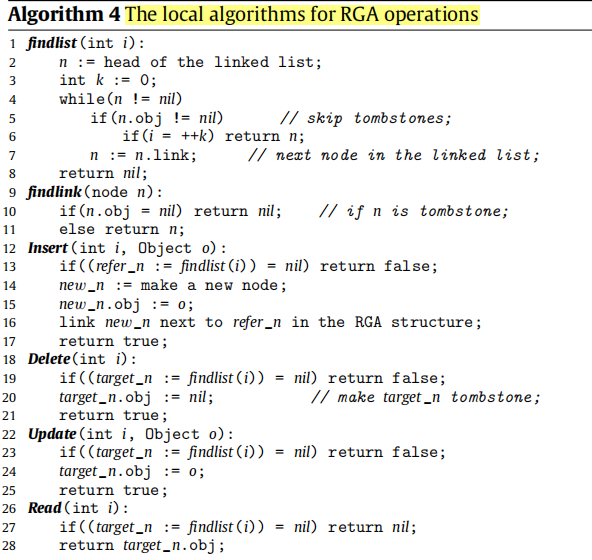
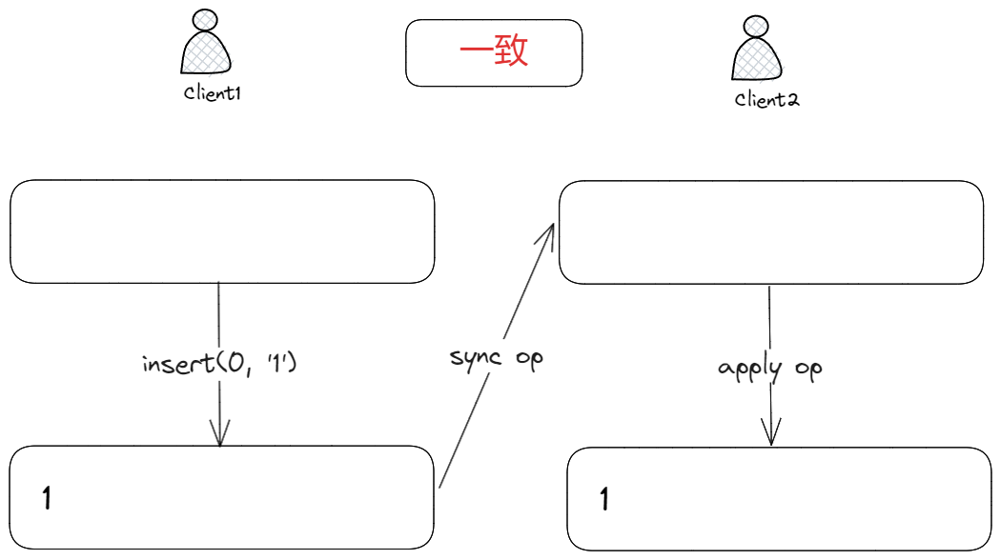
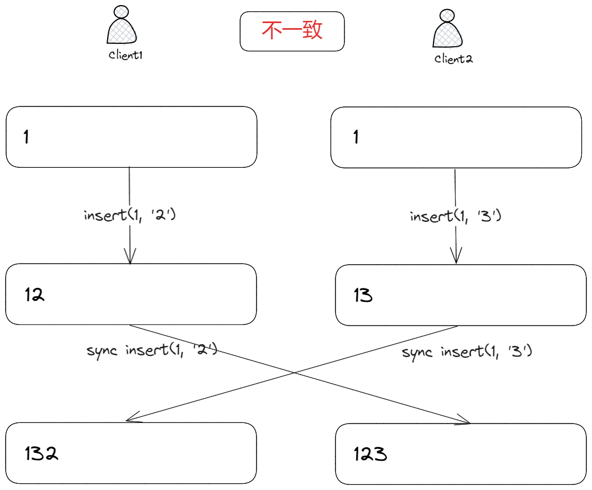
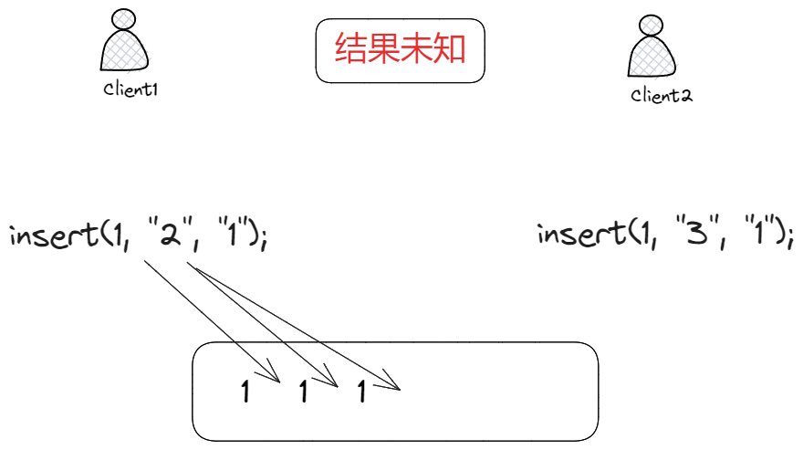
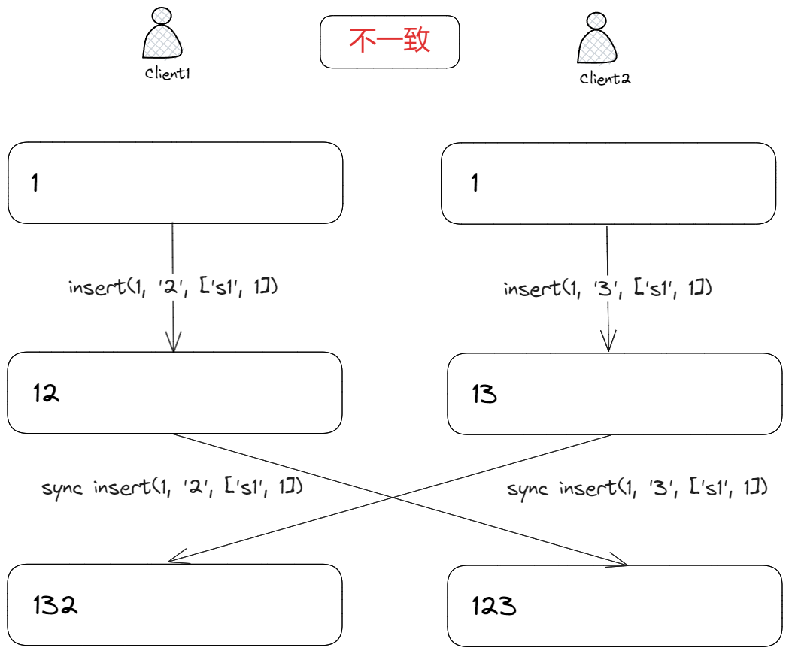
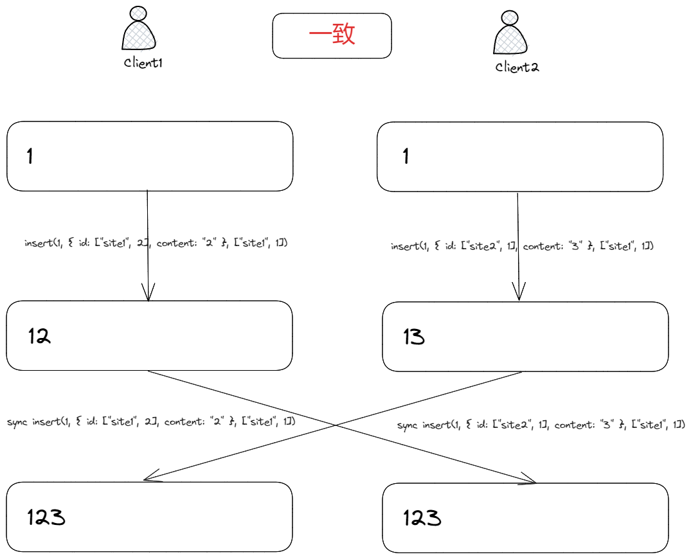
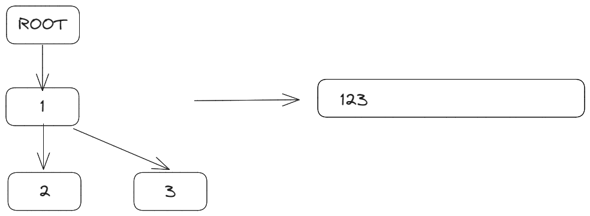
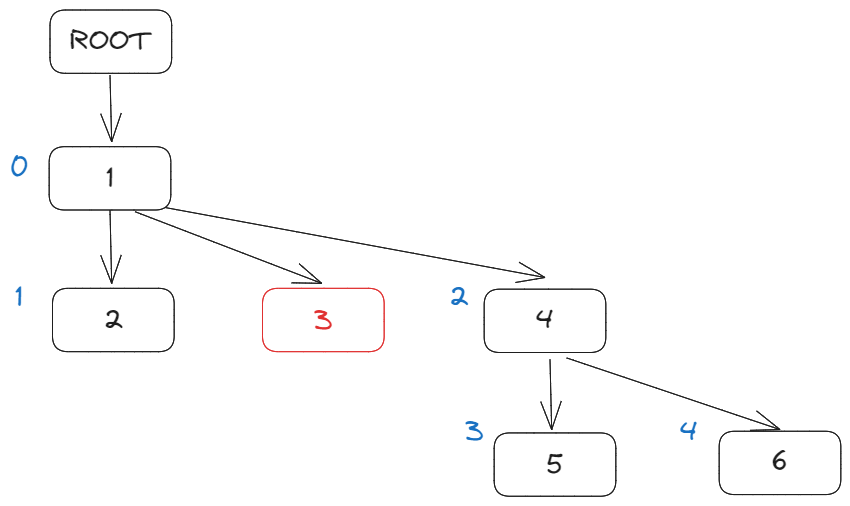

## 前言

[上一篇文章](./crdt1.md)我们介绍了 CRDT 的基本概念，探讨了一些基础 CRDT 的实现。从本篇文章开始，我们将深入两种 CRDT 算法：

- [RGA](http://csl.skku.edu/papers/jpdc11.pdf)
- [YATA](https://www.researchgate.net/publication/310212186_Near_Real-Time_Peer-to-Peer_Shared_Editing_on_Extensible_Data_Types)

这两种算法分别是知名 CRDT 库 Automerge 和 Yjs 所采用的算法，被广泛应用于生产环境，是深入 CRDT 应用的基础。

本篇文章我们将介绍 RGA 算法，下一篇文章我们将介绍 YATA 算法。

## RGA

RGA 全称 Replicate Growable Array 可复制增长数组，由 Hyun 于 2011 年在论文[Replicated abstract data types: Building blocks for collaborative applications](http://csl.skku.edu/papers/jpdc11.pdf)中提出（2011 年真的是 CRDT 爆发的一年）。

> 千万别被名字吓到了，其实 RGA 就是列表的 CRDT 实现。论文原话是：  
> growable array is the Vector class of JAVA or STL.

论文中提到 RGA 在有序复制集合上拥有良好的插入、删除性能，优于已有的 OT 算法，适合用于协同文本编辑场景。

当然 RGA 不仅适用于有序文本，同时也能推广到有序列表，哈希表等场景，因此 RGA 也是 Automerge 库的基础。

论文中，给出了 RGA 基于双向链表实现的部分伪代码，如下：



伪代码实现十分简单，无论是插入还是删除，都是在链表中排除已删除项，找到`i`对应的位置，然后插入或删除即可。

不过，双向链表显然无法满足大文本编辑、查找等场景的性能要求，因此有不少优化版的 RGA 实现，比如：

- [Automerge](https://automerge.org/) 中 RGA 是基于 B+树实现的；
- [Cola](https://nomad.foo/blog/cola)中 RGA 是基于 G-tree 实现的；
- [RGATreeSplit](https://pages.lip6.fr/Marc.Shapiro/papers/rgasplit-group2016-11.pdf)使用平衡树来优化 RGA；

## 案例

下面，以[纯文本协同编辑](XXX)为例，看看 RGA 是如何工作的。

---

<RGADemo></RGADemo>

---

> 只支持简单的英文、数字文本增、删，不支持中文、复制粘贴等操作。  
> 没办法，input 中文事件笔者不会啊。

在左侧输入框中编辑文本内容，都会同步到对方，最终保证两个输入框的内容一致。

## 推演

文本内容本质上是**插入操作的集合**，因此我们可以通过插入操作来推演 RGA 的工作原理。

下面，以**纯文本**协同编辑为例，看看 RGA 是保证多方编辑内容最终一致的。

首先，我们看一个最简单的例子：**有且只有一个客户端进行编辑**



客户端 1 在位置`0`插入字符`1`，并将插入操作(op)同步到客户端 2，客户端 2 收到 op 并应用后，将`1`插入到位置`0`，此时客户端 1 和客户端 2 的文本内容是一致的。

因为只有客户端 1 有编辑操作，其它客户端处于只读状态，那么就不能产生**编辑冲突**，因此最后的文本内容肯定是一致的。

可一旦有多个客户端同时进行编辑，就会产生**编辑冲突**，导致最终文本内容不一致，比如：



客户端 1、2 分别在位置`1`插入字符`2`、`3`，并将插入操作(op)同步到对方应用后，此时客户端 1 和客户端 2 的文本内容不一致。

而产生不一致的原因是，操作同步的数据：

```js
insert(1, "2");
```

虽然携带了插入位置`1`和插入数据`2`，但没有其它约束条件，导致最终文本内容不一致。

我们可以通过**插入意图**来解决这个问题：

```js
client1: insert(1, "2", "1");
client2: insert(1, "3", "1");
```

这里，`"1"`就是插入意图，表示在`1`之后插入`2`，`3`，但这样就能保证最终文本内容一致吗？

显然是不能的，因为`1`虽然是插入意图，但是文本中可能存在多个`1`，比如：



我们为每个插入字符都添加一个唯一的标识符 Id，比如字符`1`的 Id：

```ts
// [siteId, counter]
export type Id = [string, number];
```

`Id` 包括两部分，第一部分是客户端的唯一标识符，第二部分是客户端操作的序号，这样就能保证每个字符都有唯一的 Id。

有了 Id 后，操作同步数据就变成了：

```js
// params:
// 1. 插入位置
// 2. 插入数据
// 3. 插入意图，即当前插入位置字符的 Id
insert(1, "2", ["site1", 1]);
```

这样能够保证最终文本内容一致了吗？如下：



客户端 1、2 分别在位置`1`插入字符`2`、`3`，因为两个插入操作的意图是一致的，都插入在字符`1`右侧，但字符`2`，`3`之间位置暂时不知如何排列，从而导致最终文本内容不一致。

我们可以通过字符`2`，`3`的 Id 来解决二者之间的插入排序问题，即：

```js
client1: insert(1, { id: ["site1", 2], content: "2" }, ["site1", 1]);
client2: insert(1, { id: ["site2", 1], content: "3" }, ["site1", 1]);
```

**约定**，如果插入意图一致，那么就按照字符 Id 来排序：

- 如果`counter`不同，那么按照`counter`排序，大者在右边；
- 如果`counter`相同，那么按照`siteId`排序，大者在右边；

有了排序后，最终文本内容就一致了：



最后，来看看删除操作，我们将**一次插入**抽象为一个`Item`，即：

```ts
export type Item<T> = {
  content: T | null; // 插入内容
  id: Id; // Id
  parent: Id | null; // 插入意图
};
```

至于删除，最容易想到的是将`Item`直接删除掉，但这显然不行，因此不同客户端可能在同一个插入意图上工作，如果将字符删除掉了，那么意图也就丢失了，文本最终内容也就不一致了。

因此，我们不能直接删除`Item`，而是引入**墓碑机制**，即：

```ts
export type Item<T> = {
  content: T | null; // 插入内容
  id: Id; // Id
  isDeleted: boolean;
  parent: Id | null; // 插入意图
};
```

删除`Item`时，将`isDeleted`设置为 true，这样就能保留插入意图，从而保证最终文本内容一致。

## 实现

充分推演后，我们就能给出一个[简单 RGA 的实现](XXXX)了。

首先是数据建模，每个插入字符操作被抽象为一个`Item`：

```ts
export type Item<T> = {
  content: T | null; // root item has no content
  id: Id;
  isDeleted: boolean;
  children: Id[]; // children of this item
  parent: Id | null; // parent of this item
};
```

- `parent`：插入意图；
- `children`：子节点，每个字符都可能成为多个字符的意图，因此子节点可能有多个；

很明显，这样的数据结构导致文本内容是一个树：



> ROOT 节点是虚拟节点，标识文档的开始，没有实际意义。

因此我们可以使用`Map`来存储`Item`，其中`key`是`Item.id`，`value`是`Item`。

```ts
export class Doc<T> {
  root: Id;
  length: number;
  vector: Vector;
  clientId: string;
  store: Map<string, Item<T>>;

  public constructor(clientId?: string) {
    const cid = clientId ?? randomString(6);
    const root = {
      content: null,
      id: [cid, 0],
      isDeleted: false,
      children: [],
      parent: null,
    } as Item<T>;

    // Root item should insert at the beginning, and could not be deleted or updated
    this.root = root.id;
    this.length = 0; // Exclude root item
    this.vector = {
      [cid]: 0,
    };
    this.clientId = cid;
    this.store = new Map([[Id.hash(root.id), root]]);
  }
}
```

- `root`：文档的根节点，虚拟节点；
- `length`：文档长度，不包括根节点；
- `vector`：客户端向量；
- `clientId`：客户端唯一标识符；
- `store`：存储`Item`的`Map`；

新建`Doc`时，向`store`中插入根节点，同时设置`length`、`vector`。

由于整个文档是一颗树，每个字符是其中一个节点，获取文档内容时，我们需要遍历整个树，将所有字符拼接起来：


```ts
  public getContent(): T[] {
    const doc = this;
    const content: T[] = [];
    const queue: Id[] = [];

    queue.push(doc.root);
    while (queue.length > 0) {
      const id = queue.shift()!;
      const item = doc.store.get(Id.hash(id))!;
      if (!item.isDeleted && item.content !== null) {
        content.push(item.content);
      }
      queue.push(...item.children);
    }

    return content;
  }
```

由于字符`3`被软删除掉了，因此最终文本内容是`[1, 2, 4]`。

接下来是插入操作，插入操作的核心是生成`Item`，然后将集成(intergrate，下文再详谈)到文档树中。

```ts
  public insert(pos: number, content: T) {
    const item = this.findItemByIndex(pos - 1);
    if (!item) {
      throw new Error("Item not found");
    }

    const newItem = {
      content,
      id: [this.clientId, this.vector[this.clientId] + 1],
      isDeleted: false,
      children: [],
      parent: item.id,
    } as Item<T>;

    this.integrate(newItem);
  }
```

`insert`将字符插入到`pos`位置，因此需要找到`pos-1`位置的`Item`作为其插入意图 parent，然后生成新的`Item`，最后将其集成到文档树中。

`findItemByIndex`使用 DFS 遍历文档树，排除掉删除字符，找到`pos`位置的`Item`：



```ts
  private findItemByIndex(pos: number): Item<T> | null {
    if (pos === -1) {
      return this.store.get(Id.hash(this.root))!;
    }

    const queue: Id[] = [];
    let i = pos;
    // DFS
    queue.push(this.root);
    while (queue.length > 0) {
      const id = queue.shift()!;
      const item = this.store.get(Id.hash(id))!;
      if (item.content === null) {
        queue.push(...item.children);
        continue;
      }

      if (i === 0 && !item.isDeleted) {
        return item;
      }

      if (!item.isDeleted) {
        i--;
      }
      queue.push(...item.children);
    }

    return null;
  }
```

有了`findItemByIndex`有，删除就十分简单了：

```ts
  public delete(pos: number) {
    const item = this.findItemByIndex(pos);
    if (!item) {
      throw new Error("Item not found");
    }
    item.isDeleted = true;
    this.length -= 1;
  }
```

最后，解释一下最复杂的`integrate`：

```ts
private integrate(item: Item<T>) {
    const lastClock = this.vector[item.id[0]] ?? 0;
    const clock = item.id[1];
    if (lastClock >= clock) {
      // This item has been integrated
      return;
    }
    if (lastClock + 1 !== clock) {
      throw new Error("Clock not match");
    }
    this.vector[item.id[0]] = clock;
    // 1. Find the parent item
    // 2. Insert the new item to parent.children, compare the id of new item and the next item
    // 3. Update the version and length of doc
    const parent =
      item.parent![1] === 0
        ? this.store.get(Id.hash(this.root))!
        : this.store.get(Id.hash(item.parent!))!;
    if (!parent) {
      // Root item can not integrate
      throw new Error("Parent not found");
    }

    let destIndex = 0;
    for (; destIndex < parent.children.length; destIndex++) {
      const child = parent.children[destIndex];
      // Smaller id should at left
      if (item.id[0] <= child[0]) {
        break;
      }
    }

    parent.children.splice(destIndex, 0, item.id);
    this.store.set(Id.hash(item.id), item);
    if (!item.isDeleted && item.content !== null) {
      this.length += 1;
    }
  }
```

`integrate` 有三个核心步骤：

1. `clock`去重逻辑，如果`item`已经被集成到文档树中，那么就不需要再次集成了；
2. 找到`item`的`parent`，然后将`item`插入到`parent.children`中，这里需要注意的是，`item`的`id`需要和`parent.children`中的`id`进行比较，保证`id`小的在左边，大的在右边；
3. 更新`doc`的`length`和`vector`；

## TinyAutomerge

Automerge 是为数不多将 RGA 用在生产环境上的 CRDT 库，RGA 是 Automerge 中的核心算法部分，设计方式和实现思路都很有借鉴性。

笔者实现了一个 toy 版本：[TinyAutomerge](xxxx)。

TinyAutomerge 是 Automerge 的一个极简版本，它是按照笔者个人理解以及 [Automerge 文档](https://cdnm67bsp6.feishu.cn/docx/UvbRdESXzor1PyxkTPvcA3xAn4b)来实现的，可以帮助我们更好的理解 Automerge 和 RGA。

> Automerge 中 RGA 的[实现文档](https://cdnm67bsp6.feishu.cn/docx/UvbRdESXzor1PyxkTPvcA3xAn4b)其实已经被官方文档删除掉了，笔者在 github 上找到了以前的 commit，然后将其复制到了飞书文档，希望能帮助到对 Automerge 感兴趣的人

TODO

## 结语

## 参考资料

- [Automerge RGA Runtime](https://cdnm67bsp6.feishu.cn/docx/UvbRdESXzor1PyxkTPvcA3xAn4b)
- [awesome-crdt](https://github.com/alangibson/awesome-crdt)
- [Near Real-Time Peer-to-Peer Shared Editing on Extensible Data Types](https://www.researchgate.net/publication/310212186_Near_Real-Time_Peer-to-Peer_Shared_Editing_on_Extensible_Data_Types)
- [Replicated abstract data types: Building blocks for collaborative applications](http://csl.skku.edu/papers/jpdc11.pdf)
