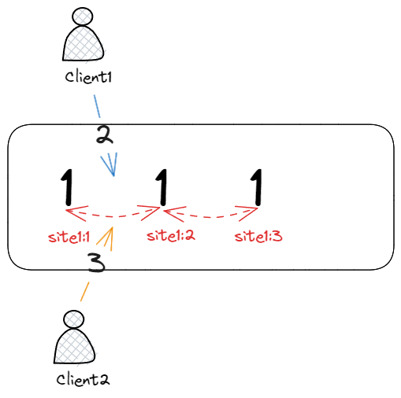
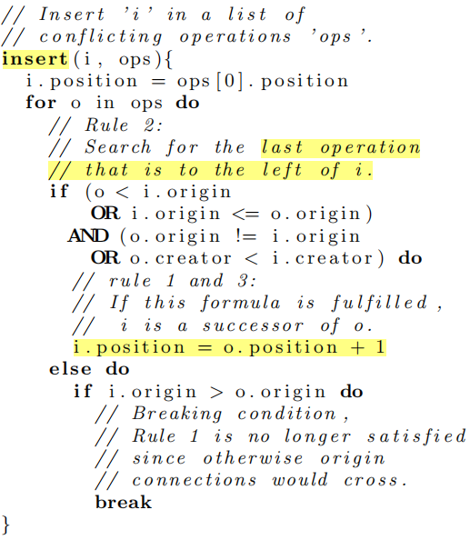
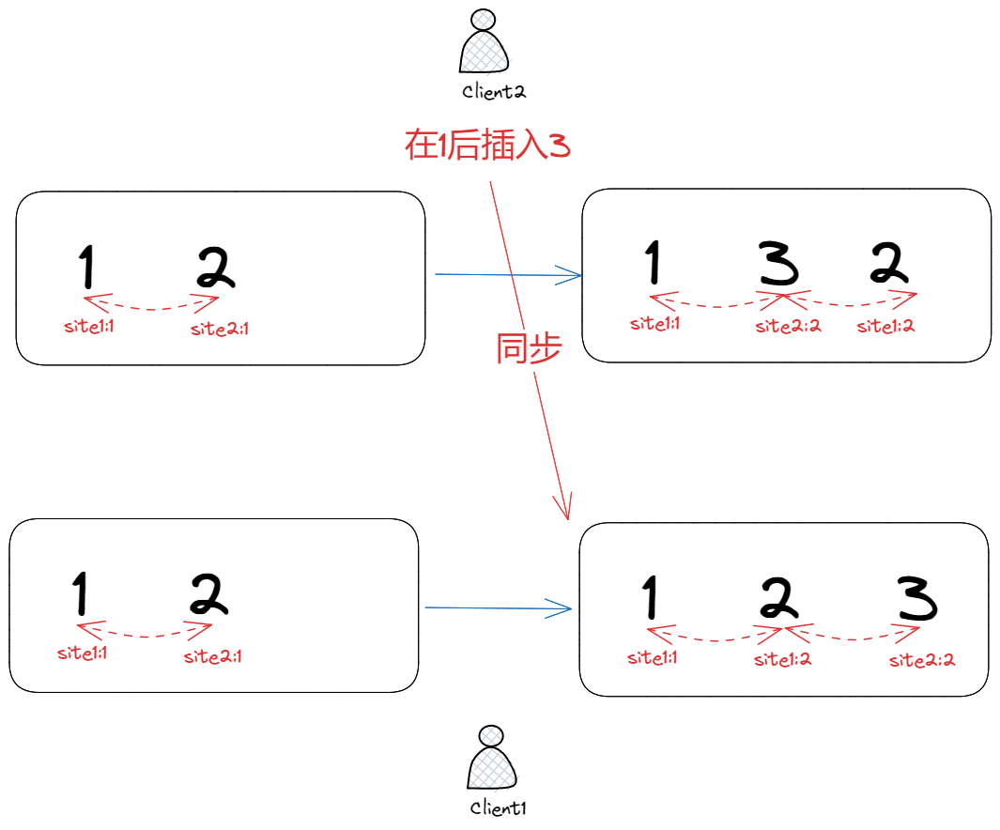

## 前言

[上一篇文章](./crdt2.md)探讨了 RGA 算法的原理与实现，本文我们将介绍另一种 CRDT 算法——[YATA](https://www.researchgate.net/publication/310212186_Near_Real-Time_Peer-to-Peer_Shared_Editing_on_Extensible_Data_Types)。

YATA 全称为 _Yet Another Transformation Approach_，于 2016 年由 Kevin 在论文 [Near Real-Time Peer-to-Peer Shared Editing on Extensible Data Types](https://www.researchgate.net/publication/310212186_Near_Real-Time_Peer-to-Peer_Shared_Editing_on_Extensible_Data_Types) 中提出。

该论文不仅贡献了 YATA 算法，还给出了 YATA 算法的开源 CRDT 协同库——[Yjs](https://github.com/yjs/yjs)。

Yjs 有着良好的架构设计，运行性能、内存消耗方面都十分优异，而且有着良好的生态，是目前生产环境使用最广泛的 CRDT 算法。

因此 YATA 是学习 CRDT，入门协同的必经之路。

> [Near Real-Time Peer-to-Peer Shared Editing on Extensible Data Types](https://www.researchgate.net/publication/310212186_Near_Real-Time_Peer-to-Peer_Shared_Editing_on_Extensible_Data_Types)论文详细阐述了协同算法的发展历史，尤其是介绍部分基本囊括了所有主流的协同算法，是学习协同算法的必读论文。

## YATA

### 三条规则

YATA 认为**文档是插入操作的集合**，保证文档有序的关键是**保证插入操作有序**，因此 YATA 的核心是**插入操作——o**：

$$
o_k(id_k, origin_k, left_k, right_k, isDeleted_k, content_k),
$$

- $id_k$：操作的唯一标识，由 lamport 时钟实现，即`[siteId, clock]`；
- $origin_k$：操作意图，操作**创建时**，左边相邻的操作项$o_i$，不会改变；
- $left_k$：$o_k$左边操作项；
- $right_k$：$o_k$右边操作项；
- $isDeleted_k$：操作是否被删除；
- $content_k$：插入的内容。

插入操作抽象为$o$，删除时，将$o$的$isDeleted$置为`true`；$left$与$right$是操作之间的左、右链接，构建出完整的插入有序链表。

遍历整个有序链表，筛掉被删除的操作，即可得到**有序**的文档内容。

$origin$的存在是为了解决**并发插入问题**，如下图所示：



客户端 1、2 同时在文本`111`中的同一位置插入新的字符`2`，`3`，此时客户端 1、2 的操作都是并发的，因此无法确定谁先谁后，对于这类并发冲突 YATA 定义了 3 条规则：

1. 禁止`origin`连线交叉；
2. 插入操作必须严格按照顺序排列，如果$o_1$与$o_2$相邻，且$o_1$在左边，即满足$o_1 <_c o_2$，那么不可能找到另外一个$o_i$比$o_1$大，同时比$o_2$小，即不可能存在$o_1 <_c o_i <_c o_2$；
3. 如果两个插入操作的`origin`一致，那么 `id` 大的字符在右边；

规则 2 很好理解，插入操作必须严格按照顺序排列，否则无法保证文档的有序性。

规则 3 借鉴了 OT 算法，当两个操作的`origin`一致时，由于无法通过`origin`来比较顺序，因此按照`id`来比较，由于`id`是唯一且确定的，这样可以保证文档在任何客户端都能最终收敛到一致。

这里，笔者尝试用自己的理解来解释规则 1，首先，`origin`连线是这样的：


字符插入后，左右连线指向当前相邻的字符，而`origin`连线只会一直指向操作创建时的左边字符，并且不会改变。

`origin`连接不会交叉，即不会出现这样的情况：


而下面的两种情况是允许的：


通过规则 1，操作意图`origin`与操作`o`这样就能得到如下的性质：

$$
o_1 <_{rule1} o_2 ⇔ o_1 < origin_2 ∨ origin_2 ≤ origin_1
$$

操作$o_1$如果在操作$o_2$的左边，通过规则 1，就能推导得出下面两种 case：

1. case1，$o_1$在$origin_2$的左边，即$o_1 < origin_2$；
2. case2，$origin_2$在$origin_1$的左边，或者 $origin_2$与$origin_1$是同一个操作，即$origin_2 ≤ origin_1$。

有了 rule1，2，3，YATA 就能保证只要操作意图`origin`不变，那么插入操作在任意副本都能收敛到全局有序，即文档内容是一致的。

> 规则 1 不好理解，论文其实并没有给出为什么要引入规则 1，而是给出规则 1,2,3 后，通过严格的数学公式证明所有插入操作最终有序；当然这也足够了，明确前提条件，能够推理正确就算理解 YATA 了；对推理过程感兴趣的可以直接看[论文](https://www.researchgate.net/publication/310212186_Near_Real-Time_Peer-to-Peer_Shared_Editing_on_Extensible_Data_Types)。

### 插入算法

每次插入操作都需要满足上面的 3 条规则，如果不满足，就需要调整操作的位置，使其满足规则。这样就能得出插入算法：



`insert`函数有两个参数：

- `i`：插入操作，即$o_k(id_k, origin_k, left_k, right_k, isDeleted_k, content_k)$；
- `ops`：与`i`有冲突的插入操作列表；

函数作用是将`i`插入到`ops`中，使其满足规则 1，2，3。

函数虽然只有 10 行左右的代码，但理解起来不容易，下面笔者尝试用自己的理解来解释这个函数。

将插入操作$i$插入到`ops`中，实际是在寻找$i.left$——$o$，然后将$i$插入到$o$后面，即 $o < i$。

$o < i$需要满足上面的 3 条规则（$o_r$：$o$的$origin$；$i_r$：$i$的$origin$）：

如果 $o_r < i_r < o < i$，那么`origin`存在交叉，无法满足，直接 break，对应算法中的`breaking condition`；

如果 $i_r < o_r < o < i$，或者 $o_r < o < i_r < i$，满足规则 1；

如果 $o_r = i_r < o < i$，需比较 creator，满足规则 3；

满足规则 1,3，那么 $i.position + 1$，直至找到满足规则 2 的$o$为止，对应图中的`for range`。

YATA 算法虽然推理起来很麻烦，但实际上最后的算法代码很少，对应到 Yjs 实现上也就是[几十行代码](https://github.com/yjs/yjs/blob/9a7b659919f6d603b1a8cc87b8dddcf5436e7ac9/src/structs/Item.js#L417)而已。

## 案例

介绍完 YATA 原理后，可以体验一下 YATA 的[实际案例](XXX)，如下是一个纯文本编辑器：

---

<YjsDemo></YjsDemo>

---

> 只支持简单的英文、数字文本增、删，不支持中文、复制粘贴等操作。  
> 没办法，input 中文事件笔者不会啊。

在左侧输入框中编辑文本内容，都会同步到对方，最终保证两个输入框的内容一致。

## 实现

在理解 YATA 算法的基础上，我们再来看看 YATA 的[实现](XXX)。

### YATA 版

首先，抽象出 YATA 的插入操作：

```ts
export type Item<T> = {
  content: T;
  id: Id;
  isDeleted: boolean;
  origin: Id | null; // null if insert at doc's begin
};
```

`Item`包含了`content`、`id`、`isDeleted`、`origin`四个属性，分别对应 YATA 插入操作的$content_k$、$id_k$、$isDeleted_k$、$origin_k$。

再看看文档的数据结构：

```ts
export class Doc<T> {
  content: Item<T>[];
  length: number;
  vector: Vector;
  clientId: string;

  public constructor(clientId?: string) {
    const cid = clientId ?? randomString(6);
    this.content = [];
    this.length = 0;
    this.vector = {};
    this.clientId = cid;
  }
}
```

`Item`中之所有没有$left_k$、$right_k$，是因为这里的实现没有选择双向链表，而是统一存储在`Doc`中的`content`列表。

- `content`：文档内容，即`Item`列表；
- `length`：文档长度，筛掉删除的`Item`后的列表长度；
- `vector`：clock 向量；
- `clientId`：客户端 ID；

首先看看`insert`函数：

```ts
  public insert(pos: number, content: T) {
    const clock = this.vector[this.clientId] ?? -1;
    // origin is previous item of pos
    const i = this.findPositionByIndex(pos);
    // create current item of pos
    const item: Item<T> = {
      content,
      id: [this.clientId, clock + 1],
      isDeleted: false,
      origin: this.content[i - 1]?.id ?? null,
    };

    this.integrate(item);
  }
```

因为墓碑机制的存在，所以`pos`并不是`content`的下标，而是`content`中未删除的`Item`的下标，所以需要先通过`findPositionByIndex`函数找到`pos`对应的`Item`的下标`i`。

然后，创建`Item`，并调用`integrate`函数将其插入到`content`中，注意：`origin`是创建时的左侧`Item`节点。

整个`insert`的核心是`integrate`，对应 YATA 中插入解决冲突部分：

```ts
  private integrate(item: Item<T>) {
    const lastClock = this.vector[item.id[0]] ?? -1;
    const clock = item.id[1];
    if (lastClock + 1 !== clock) {
      throw new Error("Clock not match");
    }
    this.vector[item.id[0]] = clock;

    // origin always front of the item
    // the origin.right may be conflict with the item
    // find the right place for the item start with origin.right
    let origin = this.findItemById(item.origin);
    let destIndex = origin + 1;
    let scanning = false;

    // search o, which i is successor of o
    // ir < or < o < i
    // or < o < ir < i
    // or = ir < minClient(o, i) < maxClient(o, i)

    // The logic below can be summarized in these two lines:
    // if (oleft < left || (oleft === left && newItem.id[0] <= o.id[0])) break
    // if (oleft === left) scanning = newItem.id[0] <= o.id[0]
    for (let i = destIndex; ; i++) {
      if (!scanning) {
        destIndex = i;
      }
      if (i === this.content.length) {
        break;
      }

      const o = this.content[i];
      const oorigin = this.findItemById(item.origin);
      // Insert i before o
      // case1: or < ir < i < o => break
      // case2: or = ir < min(i, o) < max(i, o) => break
      if (oorigin < origin || (oorigin === origin && item.id[0] <= o.id[0])) {
        break;
      }
      if (oorigin === origin) {
        scanning = item.id[0] <= o.id[0];
      }
    }

    if (!item.isDeleted) {
      this.length += 1;
    }
    this.content.splice(destIndex, 0, item);
  }
```

1. 首先，检查`clock`是否连续，如果不连续则抛出异常；
2. 然后，根据`origin`找到初始目标下标`destIndex`，即`item`的插入位置，因为并发冲突都是在`origin`后发生的，因此`destIndex`的初始值为`origin`的下标加 1；
3. 判断出`o`与`item`之间是否满足 3 条规则，满足则后移，直至找到`item`的插入位置，不满足则跳出循环，即已找到插入位置；
4. 最后，将`item`插入到`content`中。

`delete`函数十分简单，找到`pos`对应`item`然后标记`isDeleted`即可：

```ts
  public delete(pos: number) {
    const i = this.findPositionByIndex(pos);
    const item = this.content[i];
    if (!item) {
      throw new Error("Item not found");
    }
    item.isDeleted = true;
    this.length -= 1;
  }
```

### Yjs 优化版

YATA 版实现了论文原有的插入算法，但这版插入算法其实有一个严重的 base case：



客户端 1，2 有同一段文本`12`，`1`是`2`的`origin`，现在客户端 2 向`1`插入了一个`3`，按照算法规则，文本会变成`132`；

可一旦操作同步到客户端 1，因为字符`3`的`origin`是`1`，且`3`的`id`大，因此会跑到`2`的后面，导致文本变成`123`，这就导致了双方最终内容不一致。

为了解决这个问题，yjs 引入了另外一个属性`originRight`，同时规定插入的操作排序后必须在`originRight`之前，这样客户端 2 插入`3`时，由于`originRight`是`2`，因此`3`会插入到`2`的前面，最终文本变成`132`，双方达成一致，这样就解决了这个问题。

有了`originRight`后，插入操作$o$就变成了这样：

$$
o_k(id_k, origin_k, originRight_k, left_k, right_k, isDeleted_k, content_k),
$$

而这一版的[实现](XXX)，抽象出了新的`Item`类：

```ts
export type Item<T> = {
  content: T;
  id: Id;
  isDeleted: boolean;

  originLeft: Id | null; // null if insert at doc's begin
  originRight: Id | null; // null if insert at doc's end
};
```

- `originLeft`：对应上面的`origin`；
- `originRight`：即 yjs 新增的`originRight`；

`Doc`定义不变，而`insert`函数有了些许变化：

```ts
  public insert(pos: number, content: T) {
    const clock = this.vector[this.clientId] ?? -1;
    // origin is previous item of pos
    const i = this.findPositionByIndex(pos);
    // create current item of pos
    const item: Item<T> = {
      content,
      id: [this.clientId, clock + 1],
      isDeleted: false,
      originLeft: this.content[i - 1]?.id ?? null,
      originRight: this.content[i]?.id ?? null,
    };
    this.integrate(item);
  }
```

`item`在新建时，需要同时指定`originLeft`和`originRight`，且后面不会再变化。另外 `integrate` 也增加了`originRight`的判断条件：

```ts
private integrate(item: Item<T>) {
    const lastClock = this.vector[item.id[0]] ?? -1;
    const clock = item.id[1];
    if (lastClock + 1 !== clock) {
      throw new Error("Clock not match");
    }
    this.vector[item.id[0]] = clock;
    let left = this.findItemById(item.originLeft);
    let right = this.findItemById(item.originRight);
    let destIndex = left + 1;
    let scanning = false;

    for (let i = destIndex; ; i++) {
      if (!scanning) {
        destIndex = i;
      }
      if (i === this.content.length) {
        break;
      }
      // 1. Must insert between originLeft and originRight
      if (i === right) {
        break;
      }

      const o = this.content[i];
      const oleft = this.findItemById(item.originLeft);
      const oright = this.findItemById(item.originRight); // 2.
      if (
        oleft < left ||
        (oleft === left && oright == right && item.id[0] <= o.id[0]) // 3.
      ) {
        break;
      }
      if (oleft === left) {
        scanning = item.id[0] <= o.id[0];
      }
    }

    if (!item.isDeleted) {
      this.length += 1;
    }
    this.content.splice(destIndex, 0, item);
  }
```

上面的注释 1、2、3 处增加了`originRight`的判断，即必须在`originLeft`和`originRight`之间，这样就保证了插入的顺序。

## TinyYjs

yjs 是目前生产环境使用最为广泛 CRDT 库，其设计思想和实现优化都非常值得学习。

[TinyYjs](XXX) 是笔者实现的一个精简版 yjs，支持`YMap`，`YArray`，`YText（纯文本，不支持富文本）`三种数据类型，实现了基本的 CRDT 功能，但没有实现 yjs 的优化，因此可以作为一个学习 yjs 的入门项目。

- `YArray`：
  - `insert(index, content)`
  - `get(index): any`
  - `delete(index)`
  - `toArray(): any[]`
- `YText`：
  - `insert(index, content)`
  - `get(index): any`
  - `delete(index)`
  - `toString(): string`
- `YMap`：
  - `set(key, value)`
  - `get(key): any`
  - `delete(key)`
  - `has(key): boolean`
  - `toJSON(): any`

下面分别就这 3 个基础类型来介绍 TinyYjs 的实现。

### 数据建模

在 tinyyjs 中，每个插入操作被抽象为`Item`：

```ts
export class Item {
  content: ContentAny;
  id: Id;
  isDeleted: boolean;

  originLeft: Id | null; // null if insert at doc's begin
  originRight: Id | null; // null if insert at doc's end

  left: Item | null;
  right: Item | null;

  parent: AbstractType | null;
  parentSub: string | null;

  public constructor(
    content: ContentAny,
    id: Id,
    isDeleted: boolean,
    originLeft: Id | null,
    originRight: Id | null,
    left: Item | null,
    right: Item | null,
    parent: AbstractType | null,
    parentSub: string | null
  ) {
    this.content = content;
    this.id = id;
    this.isDeleted = isDeleted;
    this.originLeft = originLeft;
    this.originRight = originRight;
    this.left = left;
    this.right = right;
    this.parent = parent;
    this.parentSub = parentSub;
  }
}

export class Doc {
  share: Map<string, AbstractType>;
  vector: Vector;
  clientId: string;
  store: Map<string, Item[]>; // client id => item list

  public constructor(clientId?: string) {
    const cid = clientId ?? randomString(6);
    this.share = new Map();
    this.vector = {};
    this.clientId = cid;
    this.store = new Map();
  }
}
```

- `content`，`id`，`isDeleted`，`originLeft`，`originRight` 与上面保持一致；
- `left`，`right`是链表的左右指针，分别指向前后两个操作；

`Doc.share`是一个`Map`，key 是`AbstractType`的名字，value 是`AbstractType`的实例。

`Item.parent` 指向父节点`AbstractType`；`AbstractType`是 YArray，YMap，YText 等数据类型的基类，一个`Item`属于一个`AbstractType`，这样`Doc`就能支持多数据类型。如下：

```ts
  public getText(name: string = ""): YText {
    if (!this.share.has(name)) {
      const at = new YText(this);
      this.share.set(name, at);
    }
    return this.share.get(name) as YText;
  }

  public getArray(name: string = ""): YArray {
    if (!this.share.has(name)) {
      const at = new YArray(this);
      this.share.set(name, at);
    }
    return this.share.get(name) as YArray;
  }
```

如果`Item`的 parent 为空，代表该`Item`是游离节点，会被垃圾回收掉。

对于 YArray，YText 这类线性数据结构而言，`Item`之间通过连续的双向链表连接在一起，如下图：


对于 YMap 而言，`Item`之间是分离的，如下图：


`Item.parentSub`用来表示`YMap`的 key，`Item`是`YMap`的 value，一个`key`上的`value`可能会被多个客户端操作，因此`value`是一个小双向链表。

遵循`LWW(Last Write Won)`规则，最后写入的`Item`会覆盖之前写入的`Item`，上图中`key1`下有两个`Item`，而生效的是`a`。

`Doc.share`中所有的`AbstractType`实例，其`Item`都会被存储在`Doc.store`中，key 是`clientId`，value 是`Item`数组。

### 冲突解决

数据建模是 tinyyjs 参考 yjs 简化而来，并以此支持多数据类型，由于是多种数据类型，因此冲突解决需要稍加改变一下：

```ts
  public integrate(doc: Doc) {
    const parent: AbstractType = this.parent!;
    const parentSub = this.parentSub;
    const getItem = (id: Id | null) => doc.getItem(id);
    if (
      (!this.left && (!this.right || this.right.left !== null)) ||
      (this.left && this.left.right !== this.right)
    ) {
      let left = this.left; // 插入时的左边节点，即插入origin

      let o; // 是否具有冲突的节点
      // set o to the first conflicting item
      if (left !== null) {
        // list, text set left to the first conflicting item
        o = left.right;
      } else if (parentSub !== null) {
        // map sets left to the first item with the same key
        o = parent._map.get(parentSub) || null;
        while (o !== null && o.left !== null) {
          // map, set o to the first item of key
          o = o.left;
        }
      } else {
        o = parent._start; // default set o to the first item
      }

      const conflictingItems = new Set();
      const itemsBeforeOrigin = new Set();
      // Let c in conflictingItems, b in itemsBeforeOrigin
      // ***{origin}bbbb{this}{c,b}{c,b}{o}***
      // Note that conflictingItems is a subset of itemsBeforeOrigin
      while (o !== null && o !== this.right) {
        itemsBeforeOrigin.add(o);
        conflictingItems.add(o);
        if (Id.compare(this.originLeft, o.originLeft)) {
          // case 1
          if (o.id[0] < this.id[0]) {
            // 如果o的clientID小于this的clientID，那么o在this的左边，大的在右边
            left = o;
            conflictingItems.clear();
          } else if (Id.compare(this.originRight, o.originRight)) {
            // 右插入意图相同，则直接break
            // this and o are conflicting and point to the same integration points. The id decides which item comes first.
            // Since this is to the left of o, we can break here
            break;
          } // else, o might be integrated before an item that this conflicts with. If so, we will find it in the next iterations
        } else if (
          o.originLeft !== null &&
          itemsBeforeOrigin.has(getItem(o.originLeft))
        ) {
          // use getItem instead of getItemCleanEnd because we don't want / need to split items.
          // case 2
          if (!conflictingItems.has(getItem(o.originLeft))) {
            left = o;
            conflictingItems.clear();
          }
        } else {
          break; // 直接break，会发生意图交叉
        }
        o = o.right;
      }
      this.left = left;
    }
    // reconnect left/right + update parent map/start if necessary
    if (this.left !== null) {
      const right = this.left.right;
      this.right = right;
      this.left.right = this;
    } else {
      let r;
      if (parentSub !== null) {
        r = parent._map.get(parentSub) || null;
        while (r !== null && r.left !== null) {
          r = r.left;
        }
      } else {
        r = parent._start;
        parent._start = this;
      }
      this.right = r;
    }
    // for map
    if (this.right !== null) {
      this.right.left = this;
    } else if (parentSub !== null) {
      // set as current parent value if right === null and this is parentSub
      parent._map.set(parentSub, this);
      if (this.left !== null) {
        // this is the current attribute value of parent. delete right
        this.left.delete();
      }
    }
    doc.addItem(this);
  }
```

这段冲突解决代码几乎与 [yjs](https://github.com/yjs/yjs/blob/9a7b659919f6d603b1a8cc87b8dddcf5436e7ac9/src/structs/Item.js#L417) 一致，这里简单解释一下。

1. `Item`插入时，`Item.left`会被初始化为`Item.originLeft`，因此与其有冲突的节点从`Item.left`开始，直到`Item.right`，这些节点都有可能是冲突节点。
2. 如果是 YArray，YText，第一个冲突节点是`left.right`，如果是 YMap，第一个冲突节点是`parent._map.get(parentSub)`对应的最左边节点；
3. 插入位置需要遵循 3 条规则，虽然改成了双向链表，但是判断逻辑基本一致；
4. 最后，将`Item`插入到链表中。

对于 tinyyjs 的介绍就到这里，感兴趣的可以查看[源码](XXX)。

## 结语

关于 YATA 算法，就介绍到这里。

后续文章会对 yjs 实现做一次解密，看看明星 CRDT 库是如何实现的。

## 参考资料

- [YATA 线性数据插入算法 - 掘金](https://juejin.cn/post/7030327499829542942)
- [(PDF) Near Real-Time Peer-to-Peer Shared Editing on Extensible Data Types](https://www.researchgate.net/publication/310212186_Near_Real-Time_Peer-to-Peer_Shared_Editing_on_Extensible_Data_Types)
- [CRDTs go brrr](https://josephg.com/blog/crdts-go-brrr/)
- [Operation-based CRDTs: arrays (part 1)](https://www.bartoszsypytkowski.com/operation-based-crdts-arrays-1/)
- [Deep dive into Yrs architecture](https://www.bartoszsypytkowski.com/yrs-architecture/)
- [yjs INTERNALS](https://github.com/yjs/yjs/blob/main/INTERNALS.md)
