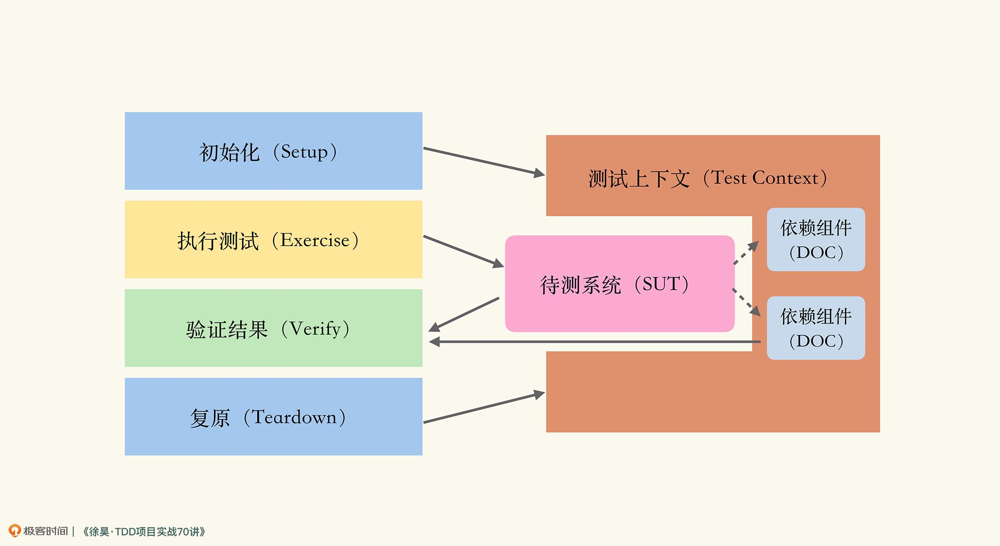
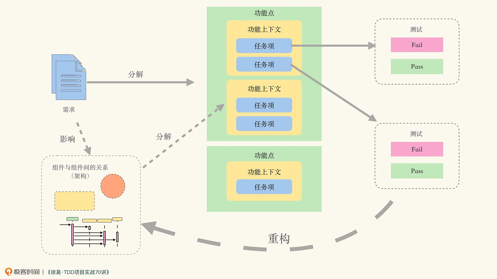

[原文](https://www.kdocs.cn/l/cbRO9I8FiOb2)

## 收获点

> TDD 不是一种写代码方法，而是一种功能迭代模式。

1. 理解需求，找到需求输入、输出；
2. 拆解需求，如何将一个需求拆解为子任务，并以测试来驱动子任务实现；
3. 克服恐惧，不再指望一次性完成需求，而是慢慢测试迭代，保证鲁棒性；
4. 按照 红-> 绿 -> 重构循环来不断推进代码；
5. 单测不通过-> 红灯，改生产代码；
6. 单测通过 -> 绿灯，重构生产代码；
7. 尽量使用可读的方法名替代注释；
8. 由于初期良好的绿灯重构，代码结构规整，责任分配良好，因此后续代码越写越快，效率越来越高；
9. TDD 的 3 个特点：  
   a. 将功能拆分为一系列任务，再将任务转化为测试，以测试体现研发进度，将开发过程变成有序的流程，减少无效劳动；  
   b. 修改代码时，可以及时通过测试来回归，发现错误后可快速定位，降低 bug 带来的成本；  
   c. 时刻感知认知提升，克服恐惧。
10. TDD 是帮助我们从可用代码进化到优质代码的一种优秀的工程实践方法，在没有上帝视角的情况下，唯有通过实践才能得知在当前条件下哪个路径是最佳的，TDD 可以帮助减小改进的成本，固化测试知识，每进行一次回归测试收益就增加一次。
11. 测试步骤：setup -> exercise -> verify -> teardown
    
12. 验证方式：状态验证，行为验证  
    a. 对于状态验证，在引入三方中间件的情况下，会引入不断增长的数据，因此可以使用增量验证的方式来完成测试，比如测试插入一条数据，先查询已有数据数量，然后再插入一条数据，然后再查询现有数据数量，比较先后数量的差值为 1 即可；  
    b. 行为验证没有状态验证直观和方便，但是对于一些需要 mock 的场景，比如数据库 mock，如果是状态验证，那么必须得拿到数据才能验证，因此我们必须得引入数据 mock，但如果是行为验证，对数据结果不关心的情况下，我们只需关心函数是否被调用，功能是否 work，如下：

    ```java
    @Test
    public void should_parse_value_if_flag_present() {
        // 并不会真正的去解析，而是需要验证返回值，具体的说是验证 parse函数是否被调用
        // 因此此处，状态验证就会先得很别扭，我们将其改造为行为验证
        Object parsed = new Object();
        Function<String, Object> parse = (it) -> parsed;
        Object whatever = new Object();
        assertSame(parsed, OptionParsers.unary(whatever, parse).parse(Arrays.asList("-p", "8080"), option("p")));
    }

    @Test
    public void should_parse_value_if_flag_present2() {
        Function parse = Mockito.mock(Function.class);
        OptionParsers.unary(Mockito.any(), parse).parse(Arrays.asList("-p", "8080"), option("p"));
        Mockito.verify(parse).apply("8080"); // 验证 parse方法被调用，并且传入参数为 8080
    }
    ```

    举一个业务例子：
    StudentRepository 是一个 JPA 代理的仓储服务：

    ```java
    @Repository
    public interface StudentRepository extends JpaRepository<Student, Long> {
        Optional<Student> findByEmail(String email);
    }StudentServiceImpl 将其引入，并作为查询数据库数据的代理：
    public class StudentServiceImpl implements StudentService {

        private final StudentRepository studentRepository;

        public StudentServiceImpl(StudentRepository studentRepository) {
            this.studentRepository = studentRepository;
        }

        @Override
        public Optional<Student> queryOneById(Long id) {
            return studentRepository.findById(id);
        }
    }
    ```

    如果是状态测试，那么我们必须引入数据库 Mock，比如 H2 等；实际上，studentRepository.findById 是由 JPA 保证正确性的，我们对状态结果并不关系，即使测试环境下 H2 的用例全部通过了，等到了生成环境数据库采用了 MySQL，也不一定能保证测试通过，因此我们的核心诉求是验证 findById 这个函数是否被调用，即行为验证，而不是这个函数返回的结果，即状态验证，那么行为测试我们可以这样写:

    ```java
    class StudentServiceImplTest {

        StudentRepository repository;

        @BeforeEach
        public void before() {
            repository = Mockito.mock(StudentRepository.class);
        }

        @Test
        void queryOneById() {
            var service = new StudentServiceImpl(repository);
            service.queryOneById(1L);
            Mockito.verify(repository).findById(1L);
        }
    }
    ```

    这样，对于 queryOneById 这个方法，我们每天验证其返回的数据，而是通过 Mockito 来验证内部的 findById 函数是否被成功调用，且传入的参数是否正确，这样就减少了依赖的复杂度。

13. 行为验证的适用场景（状态数据难以得到，就采用行为测试）：  
    a. 微服务调用  
    b. 三方支付场景  
    c. MQ  
    d. 数据库  
    e. so on...
14. 行为测试对 TDD 的用处不大，核心在于行为测试必须先写一篇测试实现代码，然后在生产代码再写一遍，另外 TDD 本质上就是拆分为多个小任务，每个小任务都有明确的结果验证再继续推进；行为验证本身并不能验证功能是否正确，而只能验证功能是否按照某种方式实现，这与 TDD 的核心逻辑就冲突了。在 TDD 的红 / 绿 / 重构中，重构要求在功能不变的前提下，改变实现方式。而对于行为验证而言，实现方式改变就是功能改变（代码变更）。因而重构就无法进行！需要重写！也就是说，行为验证会阻碍 TDD 的进行；虽然行为验证的主要目的是降低测试成本，但如果丧失了测试的有效性，那么成本再低也是无意义的；将行为验证放在接口而非实现上；
15. 在 TDD 的语境下，“单元测试”指的是能提供快速反馈的低成本的研发测试（Developer Test），Martin 将其称为极限单元测试（Xunit Test）：  
    a. TDD 中的测试是由不同粒度的功能测试构成的；  
    b. 每一个测试都兼具功能验证和错误定位的功效；  
    c. 要从发现问题和定位问题的角度，去思考测试的效用与成本；  
    d. 单元粒度要以独立的功能上下文或变化点为粒度。
16. 将所有直接耦合都视为坏味道的设计取向，会将功能需求的上下文打散到一组细碎的对象群落中，增加理解的难度。最终滑向过度设计（Over Design）的深渊；
17. 测试驱动开发的主要关注点在于功能在单元（模块）间的分配，而对于模块内怎么实现，需要你有自己的想法，因此测试驱动开发在“单元（模块）内的实现方式”失去驱动力；
18. TDD“驱动”的是架构，因而实际是一种架构技术；
19. 从功能测试出发，逐步完成软件开发，这或许没问题。但架构怎么办？实际上，红 / 绿 / 重构循环中的重构就是解决架构问题的。只不过架构并不是预先设计的（Upfront Design），而是在完成功能的前提下演进而来的，因而也称演进式设计（Evlutionary Design）；
20. “最晚尽责时刻”让我们不必花费时间进行空对空的讨论，可以尽早开始实现功能，再通过重构从可工作的软件（Working Software）中提取架构。这种方式也被称作 TDD 的经典学派（Classic School）或芝加哥学派（Chicago School）。除了经典学派之外，还有一种 TDD 风格，被称作 TDD 的伦敦学派（London School）。如果架构愿景已经比较清晰了，那么我们就可以使用伦敦学派进行 TDD；
21. 伦敦学派是在组件结构、接口定义的情况下开始 TDD，而经典学派是没有架构设计，只有输入、输出的情况下，通过 TDD 一步步推出架构；
22. 伦敦学派可以先对其他组件（功能函数）进行打桩（Stub），返回固定值，对某个模块用 TDD 驱动开发，最后完成全部开发：
    ```java
    @Test
    void should_query_one_by_id() {
        Mockito.when(repository.findById(1L)).thenReturn(Optional.of(new Student("pedro", "1312342604@qq.com")));
        var service = new StudentServiceImpl(repository);
        Optional<Student> student = service.queryOneById(1L);
        assertTrue(student.isPresent());
        assertEquals("pedro", student.get().getName());
    }
    ```
    在这个测试例子中，已知 StudentServiceImpl 一定会依赖 StudentRepository，这是墨守成规的 MVC 模式，因此我们不需要 TDD 来推出这个架构，而是可以直接给出分层代码，在 StudentServiceImpl 单元模块推进下，完全可以对 StudentRepository 进行打桩，然后驱动其开发。
    无论是伦敦学派，还是经典学派，都是 TDD 的一种模式，都需要掌握。
23. TDD 流程：
    
    • 首先将需求分解为功能点，也就是将需求转化为一系列可验证的里程碑点；  
    • 如果已经存在架构或架构愿景，则依据架构中定义的组件与交互，将功能点分解为不同的功能上下文；  
    • 如果尚不存在架构愿景，则可以将功能点作为功能上下文；  
    • 将功能点按照功能上下文，分解为任务项。也就是进一步将可验证的里程碑点，分解为功能上下文中可验证的任务项；  
    • 将任务项转化为自动化测试，进入红 / 绿 / 重构循环，驱动功能上下文内的功能实现；  
    • 如果重构涉及功能上下文的重新划分，即提取 / 合并组件，即视作对于架构的重构与梳理。需调整后续功能点中对于功能上下文以及任务项的划分。  
    • 如此往复，直到所有功能完成。

---

## 思考点

1. TDD 重构是否过度？至少在课程中，我觉得有些重构是过度的，尤其是类架构的更改导致了大量的测试也更改，这是否会导致大量时间都用在了产出不大的重构上？
2. 如果测试书写良好？那么在生产时可以适当重构后即可交付，优先保证质量和速度，因为测试覆盖率高，交付后仍然可以后续再来绿灯重构，持续提升代码质量。
3. 在整个参数解析案例完成后，可以发现生产代码非常少，也就 200 ～ 300 行，但是却经历了好几次的重构而来，代码由少变多，再由多变少，整个过程都是在测试驱动下完成的；因此沉淀了大量的测试用例和测试代码，保证了代码质量和可测试性。
4. 试想，如果是需求多变的业务代码，能不能采用测试先行的方式了？我想是很难的，没有知道产品和老板会怎么样？那么如何保证代码质量呢？就我个人而言，代码分层是一种很好的模式，将核心层代码通过 TDD 来迭代保证质量，业务层代码随时应变，或者激进一点，使用 BDD 来验证？但以我之前在腾讯的工作经历来看，这几乎不可能，当然不同的公司有不同的模式，及时跟 leader 和 boss 沟通再来推进。
5. 如果是核心类库，那么测试上下文（setup）相对简单，不会涉及到任何中间件、数据库等，但是如果是业务代码就肯定会存在大量的中间件、通信依赖，这样测试的上下文就会复杂很多，直接影响测试编写难度和测试维护成本。
6. 过去的代码开发过程中，我似乎一直很注重实现和功能完成，对于代码测试和工程质量的重视程度不够，很多时候因为测试的复杂性而选择放弃测试，从而导致代码越来越难以维护，越来越难以测试，严重拉低了工程质量；完成功能不代表做完了需求，而是需要严格的测试和验证来保证自己的正确性。
7. 工程师三驾马车：
   a. 基础知识（操作系统、数据库、编译原理 and so on...）
   b. 工程能力（沟通能力，理解需求，拆解需求，落地场景 tradeoff，基本工程方法论）
   c. 编码能力（拆解任务，实现需求，代码质量，测试）
